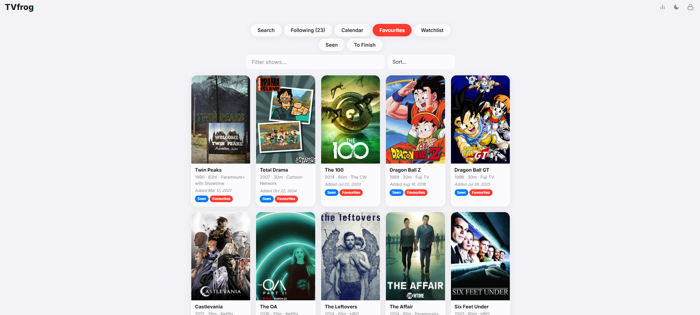
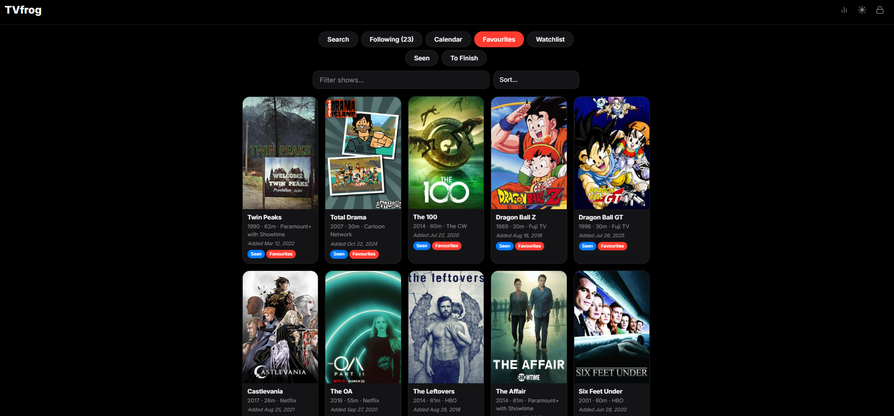
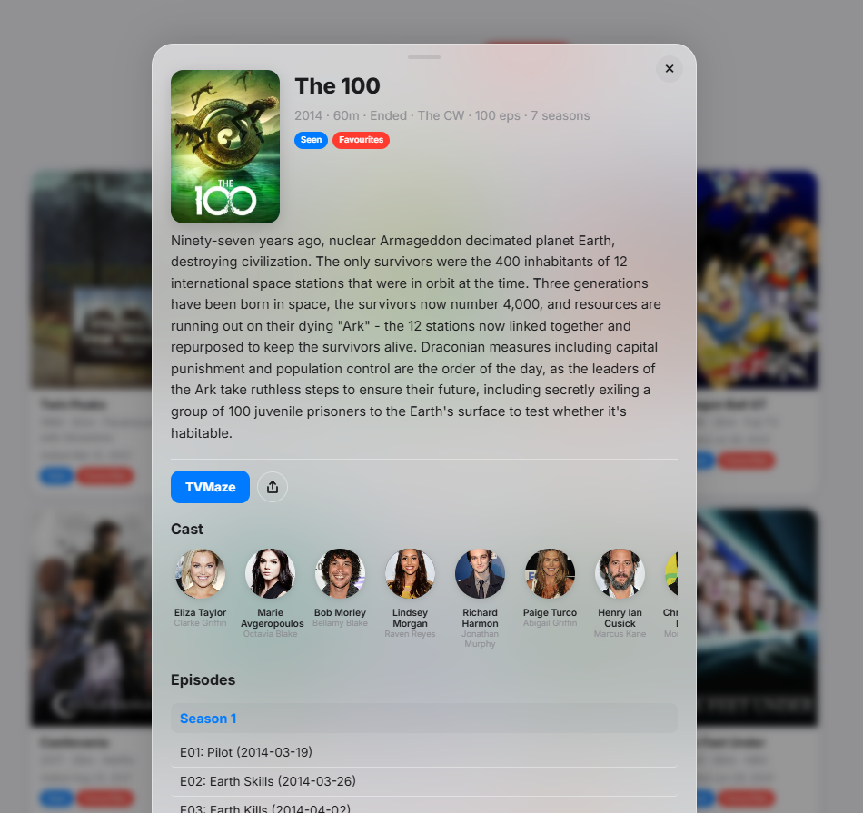

<p align="center">
  
</p>

<h1 align="center">TVfrog</h1>
<p align="center"><strong>Your personal TV show tracker.</strong></p>
<p align="center">
  A self-hosted web app to track TV shows, organize into lists, follow upcoming episodes, and explore your viewing stats. Zero database — runs on any PHP hosting.
</p>

<p align="center">
  
  
  
  
  
  <a href="https://paypal.me/nowfrog">
    
  </a>
</p>

<p align="center">
  <a href="https://nowfrog.com/tvfrog/"><strong>Live Demo</strong></a> · <a href="#features"><strong>Features</strong></a> · <a href="#getting-started"><strong>Getting Started</strong></a> · <a href="#screenshots"><strong>Screenshots</strong></a> · <a href="#support-the-project"><strong>Donate</strong></a>
</p>


## Overview

TVfrog is a lightweight, self-hosted TV show tracker. Search any show via TVMaze, add it to custom lists, follow shows to track upcoming episodes, and explore stats about your viewing habits. All data is stored in a single JSON file — no MySQL, no database setup, just upload to any PHP hosting and go.

**No API key required.** TVfrog uses the [TVMaze API](https://www.tvmaze.com/api) which is completely free and open.

Installable as a **Progressive Web App (PWA)** on mobile and desktop.


## Features

### TV Show Lists
- **Default lists** — Favourites, Watchlist, Seen, To Finish (create your own too)
- **Color-coded tags** on show cards showing which lists a show belongs to
- **Filter and sort** within lists — by name, year, rating, episodes, or date added
- **Show data cached locally** — lists load instantly, no API calls after first add

### Show Details
- **TVMaze integration** — search by title, get poster, summary, genres, runtime, network, status
- **Cast with photos** — scrollable cast section with actor photos and character names
- **Full episode list** — organized by season, each episode clickable to TVMaze page
- **Next episode info** — countdown to the next airing episode
- **Share button** — share show info via native share or clipboard

### Calendar
- **Follow shows** to track their upcoming episodes
- **Calendar view** — see all upcoming episodes sorted by date
- **Countdown** — days until next episode, with TODAY/TMR highlights
- **Only upcoming** — no clutter from ended shows

### Following System
- **Follow/Unfollow** from the show modal (admin only)
- **Following view** — see all followed shows with status and unfollow button
- **Refresh all** — one-click button to update all show data from TVMaze

### Stats Page (Seen list)
- **Animated hero** with show counter
- **Real runtime** — calculated from actual episode count × average runtime
- **Insight cards** — total episodes, runtime (switchable), avg rating, episodes per show, total seasons, top network
- **Dynamic phrases** — fun facts based on your data
- **Most seen actors** with photos
- **Charts** — genres (donut), networks, decades, countries, show status
- **Shows added per year**
- **Highest rated and longest binges** with posters

### Admin Panel
- **Lock icon** in header — click to login
- **Manage Shows** — add/remove shows from lists, create/delete lists
- **Search TVMaze** with live dropdown results
- **Follow/Unfollow** from show modals
- **Refresh all data** — update all cached show data in one click

### Design
- **iOS Liquid Glass** aesthetic — glassmorphism, backdrop blur, rounded corners
- **Light and dark mode** with matching status bar colors
- **Bottom sheet modal** — slides up from bottom like native iOS
- **No pinch-to-zoom**, hidden scrollbars — clean mobile experience
- **PWA installable** — add to home screen with proper icon and title

### Technical
- **Zero database** — everything in one JSON file
- **No API key needed** — TVMaze is free and open
- **PHP backend** — session-based auth, simple data read/write
- **Vanilla JS** — no frameworks, no build step
- **Bcrypt passwords** — admin password is securely hashed
- **Setup wizard** — configure on first visit


## Getting Started

### Requirements

- Any web hosting with **PHP 7.4+** (shared hosting works fine)
- That's it. No API key, no database, no Node.js.

### Installation

1. **Download** or clone this repository:
   ```bash
   git clone https://github.com/nowfrog/tvfrog.git
   ```

2. **Upload** the folder to your web hosting (e.g., into `public_html/tvfrog/`)

3. **Visit** `https://yoursite.com/tvfrog/admin/api/setup.php` in your browser

4. **Choose** an admin password (min 6 characters)

5. **Done!** Visit `https://yoursite.com/tvfrog/` and start tracking shows

### Manual Configuration (alternative)

1. Copy `admin/api/config.example.php` to `admin/api/config.php`
2. Generate a password hash:
   ```bash
   php -r "echo password_hash('yourpassword', PASSWORD_BCRYPT);"
   ```
3. Paste the hash into `config.php`
4. Copy `data/app_data.example.json` to `data/app_data.json`


## Project Structure

```
tvfrog/
├── admin/api/
│   ├── setup.php           # First-time setup wizard
│   ├── config.php          # Your config (gitignored)
│   ├── config.example.php  # Template
│   ├── auth.php            # Login/logout
│   └── data_handler.php    # Data read/write
├── data/
│   └── app_data.json       # All show data (gitignored)
├── index.html              # Main app
├── app.js                  # App logic
├── style.css               # Styles (iOS liquid glass)
├── stats.html              # Stats page
├── site.webmanifest        # PWA manifest
└── favicon-*.png           # Icons
```


## Screenshots

<p align="center">
  
</p>
<p align="center"><em>Light mode — Favourites list with color tags, filter and sort</em></p>

<p align="center">
  
</p>
<p align="center"><em>Dark mode — iOS liquid glass aesthetic</em></p>

<p align="center">
  
</p>
<p align="center"><em>Show modal — details, cast, episodes with links, list tags</em></p>


## Tech Stack

| Technology | Purpose |
|-----------|---------|
| Vanilla JS | Frontend — no frameworks, no build step |
| PHP | Backend — session auth, JSON data handler |
| JSON file | Data storage — single file, no database |
| [TVMaze API](https://www.tvmaze.com/api) | Show data, cast, episodes (free, no key) |
| [Chart.js](https://www.chartjs.org/) | Stats page charts |
| CSS Variables + Backdrop Filter | iOS liquid glass theming |


## Contributing

Contributions are welcome! Feel free to:

- 🐛 [Report bugs](https://github.com/nowfrog/tvfrog/issues)
- 💡 [Request features](https://github.com/nowfrog/tvfrog/issues)
- 🔧 Submit pull requests


## Support the Project

TVfrog is free and open-source. If it helps you track your shows, consider supporting development:

<p align="center">
  <a href="https://paypal.me/nowfrog">
    
  </a>
</p>


## License

[MIT](LICENSE). Free to use, modify, and distribute.

<p align="center">
  Made with 🐸 by <a href="https://github.com/nowfrog">nowfrog</a>
</p>
